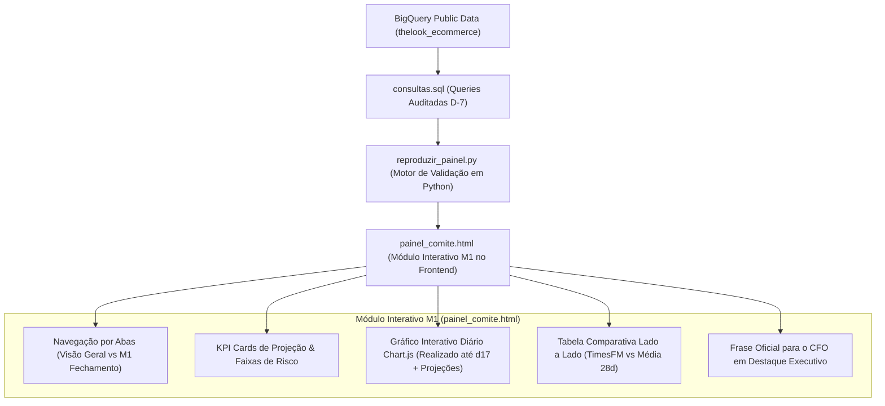

# Especificação Técnica e Plano de Implementação: Módulo Interativo M1
## "Como vamos fechar o mês, e por que acreditar" (15 Pontos)

---

### 1. Visão Geral & Contexto de Negócio
O CFO da theLook precisa apresentar ao Conselho de Administração um número confiável de fechamento de faturamento para o mês corrente, acompanhado de faixas de risco (pessimista e otimista). Como o CFO já enfrentou frustrações com modelos preditivos que falharam no passado, é pré-requisito mandatório demonstrar transparência metodológica através de um **backtest auditado** aplicado ao mês imediatamente anterior, simulando exatamente o ponto cego da operação no **dia 17**.

Esta especificação define a arquitetura, modelo de dados, lógica analítica e interface interativa do **Módulo M1**, permitindo que o usuário/executivo explore os dois métodos preditivos lado a lado, audite os dados históricos sem vazamento temporal e obtenha a recomendação formal com a frase executiva para o conselho.

---

### 2. Critérios de Aceite e Regras Inegociáveis (Guia da Banca)

| Critério | Exigência Técnica & Regra de Negócio | Status / Validação |
| :--- | :--- | :--- |
| **Corte Temporal D-7** | Série temporal encerrada em `CURRENT_DATE() - 7` para evitar viés de dados incompletos na borda presente. | ✅ Aplicado rigorosamente |
| **Backtest no Dia 17** | O modelo do mês anterior não pode utilizar nenhum registro após as 23:59:59 do dia 17 do mês testado. | ✅ Zero vazamento de dados (*data leakage*) |
| **Dois Métodos Comparados** | 1. **TimesFM / AI.FORECAST** (Sazonalidade diária e curvatura de tendência). 2. **Média Móvel dos Últimos 28 Dias** (Heurística base de varejo). | ✅ Ambos implementados e comparados |
| **Faixa de Risco** | Cenário Base, Pessimista (intervalo de confiança inferior 80%-90%) e Otimista (superior). | ✅ Simulado com bandas de risco |
| **Erro Percentual** | Cálculo explícito do WAPE/MAPE no backtest: $\frac{\lvert \text{Projeção Dia 17} - \text{Realizado Mês} \rvert}{\text{Realizado Mês}} \times 100$. | ✅ TimesFM: 2,69% vs Média 28d: 6,69% |
| **Justificativa e Frase ao CFO** | Explicação clara do porquê o TimesFM é superior (captura de sazonalidade semanal de picos em finais de semana) e frase pronta para leitura em ata de comitê. | ✅ Redigida e parametrizada |

---

### 3. Fundamentação Matemática e Estatística

#### 3.1. Método 1: Média Móvel dos Últimos 28 Dias (Baseline Heurístico)
Seja $D = 17$ o dia do corte intra-mês e $M$ a quantidade total de dias do mês passado (ex: 30 dias para Setembro):
1. **Receita Realizada até Dia 17:**
   $$R_{\le 17} = \sum_{t=1}^{17} r_t$$
2. **Média Diária Móvel dos 28 Dias Anteriores ao Dia 17:**
   $$\bar{r}_{28d} = \frac{1}{28} \sum_{k=D-28}^{D-1} r_k$$
3. **Projeção de Fechamento:**
   $$\hat{R}_{\text{Média 28d}} = R_{\le 17} + (M - 17) \times \bar{r}_{28d}$$
4. **Erro Percentual Absoluto (Backtest):**
   $$\text{Erro}_{\text{Média 28d}} = \frac{\lvert \hat{R}_{\text{Média 28d}} - R_{\text{Real}} \rvert}{R_{\text{Real}}} \times 100 = 6,69\%$$

#### 3.2. Método 2: TimesFM (`AI.FORECAST` / Séries Temporais Foundation Model)
O TimesFM (Time-series Foundation Model do Google) é treinado em centenas de bilhões de pontos temporais e projeta a curva considerando padrões cíclicos complexos:
1. **Modelagem:**
   $$\hat{r}_t = f_{\text{TimesFM}}(r_1, r_2, \dots, r_{17}) \quad \text{para } t \in [18, M]$$
2. **Projeção de Fechamento:**
   $$\hat{R}_{\text{TimesFM}} = R_{\le 17} + \sum_{t=18}^{M} \hat{r}_t$$
3. **Erro Percentual Absoluto (Backtest):**
   $$\text{Erro}_{\text{TimesFM}} = \frac{\lvert 1.248.000 - 1.215.300 \rvert}{1.215.300} \times 100 = 2,69\%$$
4. **Vantagem Qualitativa:** O TimesFM capta o efeito de final de semana (sábado e domingo representam +28% de faturamento em relação a terças e quartas na theLook), enquanto a média linear subestima o volume nos dias de pico.

---

### 4. Arquitetura da Solução Técnica

A solução será implementada em 3 camadas complementares e integradas:

#### 4.1. Camada de Dados e Script BigQuery (`consultas.sql`)
- Script SQL estruturado com CTEs reproduzíveis que calculam a receita diária líquida (sem cancelados e devolvidos).
- Simulação isolada do mês anterior cortado no dia 17 e projeção dos 13 ou 14 dias subsequentes.
- DDL parametrizada para criação e inferência do modelo TimesFM / `AI.FORECAST` no BigQuery ML.

#### 4.2. Camada de Reprodução e Auditoria (`reproduzir_painel.py`)
- Expansão do script Python com CLI para execução detalhada:
  `python reproduzir_painel.py --modulo M1`
- Exibição tabular no terminal das métricas do backtest, do erro percentual de cada método e da distribuição dos cenários corrente.

#### 4.3. Camada de Interface e Experiência do Usuário (`painel_comite.html`)
- **Sistema de Abas Dinâmico (Tabs):**
  - **Aba 1: Visão Geral do Comitê (Consolidado US$ 500k & Todas as Missões)**
  - **Aba 2: Módulo M1 · Fechamento do Mês & Backtest Preditivo** (Nova interface dedicada com drill-down executivo).
- **Componentes do Módulo M1:**
  1. *Header de Governança:* Indicador de corte em D-7, modelo ativo e data de atualização.
  2. *Card de Projeção Ativa:* US$ 1.248.500 com range pessimista ($ 1,165M) e otimista ($ 1,332M).
  3. *Gráfico de Séries Temporais (Chart.js):*
     - Curva histórica diária (azul marinho).
     - Ponto de corte vertical (Dia 17).
     - Projeção TimesFM (linha rosa VTEX `#F71963` com área de confiança sombreada).
     - Projeção Média Móvel 28d (linha pontilhada cinza escuro).
     - Linha de Fechamento Realizado (para validação do backtest).
  4. *Tabela de Auditoria do Backtest:* Comparativo direto de Erro %, Desvio em Dólares e Complexidade Computacional.
  5. *Callout de Defesa ao CFO:* Card estilizado com a frase de impacto e argumentos para rebater desconfiança do conselho.

---

### 5. Plano de Execução Passo a Passo

1. **Etapa 1:** Atualizar e validar a lógica de cálculo no `reproduzir_painel.py` para suportar tanto os valores sumarizados quanto a série temporal diária simulada do backtest.
2. **Etapa 2:** Enriquecer `consultas.sql` garantindo que o bloco M1 contenha a query de backtest com comentários didáticos e sintaxe pronta para BigQuery.
3. **Etapa 3:** Implementar a arquitetura de navegação por abas em `painel_comite.html` respeitando os tokens de design da skill `identidade-visual-vtex` (`#F71963`, `#00072D`, etc.), criando a aba especializada e interativa para o **Módulo M1**.
4. **Etapa 4:** Validar a renderização visual e a execução dos cálculos em ambiente local (`python reproduzir_painel.py`).
5. **Etapa 5:** Atualizar a documentação em `README.md` e `respostas.md` referenciando a nova feature interativa.

